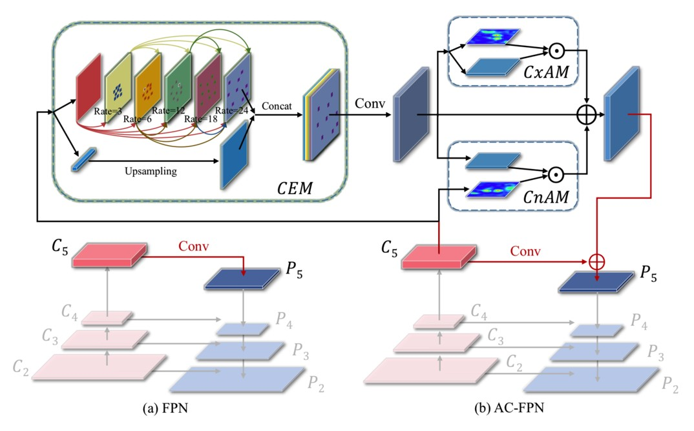

# Attention-guided Context Feature Pyramid Network for Object Detection

This repository is written by Junxu Cao, on the base of [Detectron](https://github.com/facebookresearch/Detectron) @ [e8942c8](https://github.com/facebookresearch/Detectron/tree/e8942c882abf6e28fe68a626ec55028c9bdfe1cf).

## Introduction

This repository re-implements AC-FPN on the base of [Detectron](https://github.com/facebookresearch/Detectron) and [Detectron-Cascade-RCNN](https://github.com/zhaoweicai/Detectron-Cascade-RCNN).

Please follow [Detectron](https://github.com/facebookresearch/Detectron) on how to install and use this repo.

## AC-FPN

AC-FPN can be readily plugged into existing FPN-based models and improve performance.


Object detection result
 

Instance segmentation result
 

More detail in paper.

## Benchmarking

Because of the proposed architecture, We have better performance on most of FPN-base method, especially on large objects.
 

This repo has released CEM module without AM module, but we can get higher performance than the implementation of pytorch in paper.
Also, thanks to the power of detectron, this repo is faster in training and inference.

The result of coco test-dev(team Neptune)
 
### Mask R-CNN with Bells & Whistles

<table><tbody>
<!-- START BELLS TABLE -->
<!-- TABLE HEADER -->
<!-- Info: we use wrap text in <sup><sub></sub><sup> to make is small -->
<th valign="bottom"><sup><sub>&nbsp;&nbsp;&nbsp;&nbsp;&nbsp;&nbsp;&nbsp;&nbsp;backbone&nbsp;&nbsp;&nbsp;&nbsp;&nbsp;&nbsp;&nbsp;&nbsp;</sub></sup></th>
<th valign="bottom"><sup><sub>type</sub></sup></th>
<th valign="bottom"><sup><sub>lr<br/>schd</sub></sup></th>
<th valign="bottom"><sup><sub>im/<br/>gpu</sub></sup></th>
<th valign="bottom"><sup><sub>box<br/>AP</sub></sup></th>
<th valign="bottom"><sup><sub>box<br/>AP50</sub></sup></th>
<th valign="bottom"><sup><sub>box<br/>AP75</sub></sup></th>
<!-- TABLE BODY -->
<tr>
<td align="left"><sup><sub>X-152-32x8d-FPN-IN5k-baseline</sub></sup></td>
<td align="left"><sup><sub>Mask</sub></sup></td>
<td align="left"><sup><sub>s1x</sub></sup></td>
<td align="right"><sup><sub>1</sub></sup></td>
<td align="right"><sup><sub>48.1</sub></sup></td>
<td align="right"><sup><sub>68.3</sub></sup></td>
<td align="right"><sup><sub>52.9</sub></sup></td>
</tr>
<tr>
<td align="left"><sup><sub>X-152-32x8d-FPN-IN5k-cascade</sub></sup></td>
<td align="left"><sup><sub>Mask</sub></sup></td>
<td align="left"><sup><sub>s1x</sub></sup></td>
<td align="right"><sup><sub>1</sub></sup></td>
<td align="right"><sup><sub>50.2</sub></sup></td>
<td align="right"><sup><sub>68.2</sub></sup></td>
<td align="right"><sup><sub>55.0</sub></sup></td>
</tr>
<tr>
<td align="left"><sup><sub>X-152-32x8d-FPN-IN5k-acfpn(just CEM)</sub></sup></td>
<td align="left"><sup><sub>Mask</sub></sup></td>
<td align="left"><sup><sub>s1x</sub></sup></td>
<td align="right"><sup><sub>1</sub></sup></td>
<td align="right"><sup><sub>51.9</sub></sup></td>
<td align="right"><sup><sub>70.4</sub></sup></td>
<td align="right"><sup><sub>57.0</sub></sup></td>
</tr>
<!-- END BELLS TABLE -->
</tbody></table>


## Citation

If you use our code/model/data, please site our paper:

```
@inproceedings{cai18cascadercnn,
  author = {Junxu Cao, Qi Chen, Jun Guo, and Ruichao Shi},
  Title = {Attention-guided Context Feature Pyramid Network for Object Detection},
  Year  = {2019}
}
```
and Cascadercnn:
```
@inproceedings{cai18cascadercnn,
  author = {Zhaowei Cai and Nuno Vasconcelos},
  Title = {Cascade R-CNN: Delving into High Quality Object Detection},
  booktitle = {CVPR},
  Year  = {2018}
}
```

and Detectron:

```
@misc{Detectron2018,
  author =       {Ross Girshick and Ilija Radosavovic and Georgia Gkioxari and
                  Piotr Doll\'{a}r and Kaiming He},
  title =        {Detectron},
  howpublished = {\url{https://github.com/facebookresearch/detectron}},
  year =         {2018}
}
```
